# `bin/wpcloud-site-git-deploy` Code Flow

This document covers the current `main` branch layout. The project is one Bash
CLI with an internal promotion engine. `__remote-deploy` is hidden from the
public help output because it is for tests, promotion, rollback, and diagnostic
audits, not for day-to-day operator use.

Each diagram focuses on one major path. Handler entry nodes use function start
lines; other line numbers point to where the diagrammed action happens in
`bin/wpcloud-site-git-deploy`.

## Process Entry And Dispatch

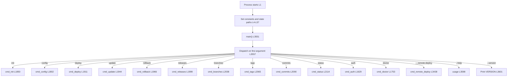

The final dispatcher is the only public entry point. Deploy and rollback call the
internal engine through `run_engine_subshell` so engine exits remain contained
and caller cleanup paths stay live. The hidden `__remote-deploy` command calls
`cmd_remote_deploy` directly for tests and audits.

## Initialize Or Reconfigure A Deployment

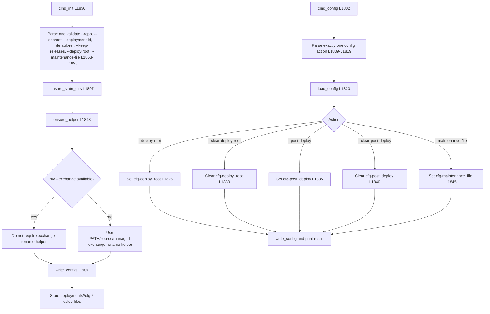

`init` creates the durable deployment configuration. `config` updates only the
supported mutable options instead of rewriting the whole deployment definition.

## Auth Setup

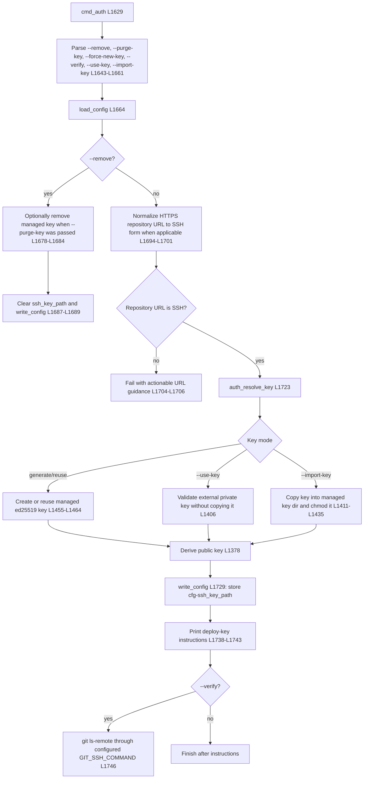

Auth never edits global SSH configuration. Git operations receive a
tool-managed `GIT_SSH_COMMAND` when `ssh_key_path` is configured.

## Doctor Diagnostics

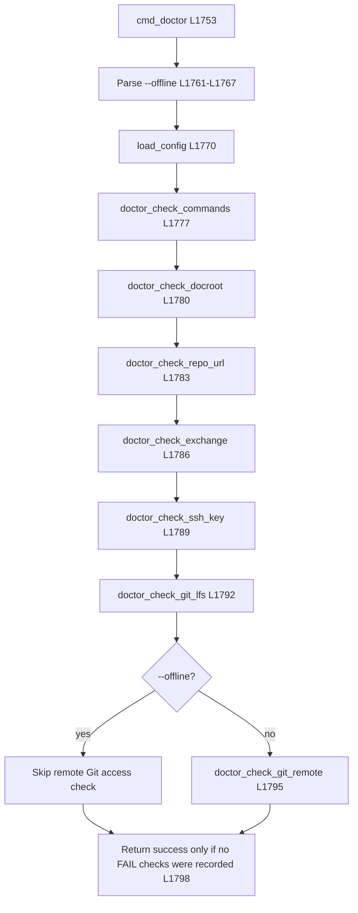

Doctor reports all discovered failures before exiting, so a first-time user gets
one actionable checklist instead of a one-error-at-a-time setup loop.

## Deploy Or Update

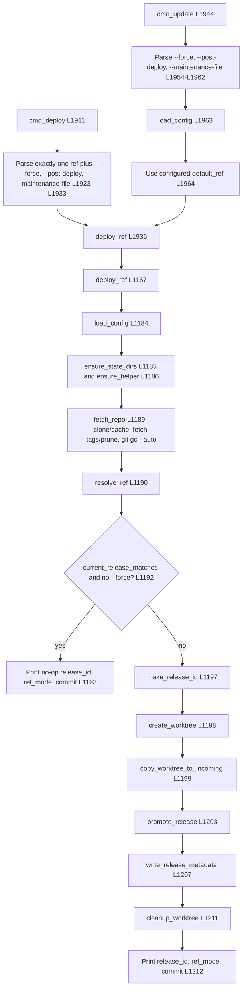

`deploy` chooses an explicit ref. `update` deploys the configured default ref.
Without `--force`, both become no-ops when the resolved commit already matches
the current release metadata.

## Worktree Preparation

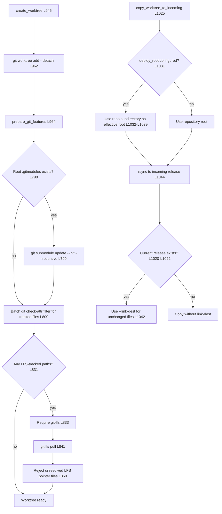

The deploy root is applied before rsync. When configured, only that subdirectory
is copied into the incoming release tree, so its contents become the docroot
root for that deployment.

## Internal Engine: Promotion

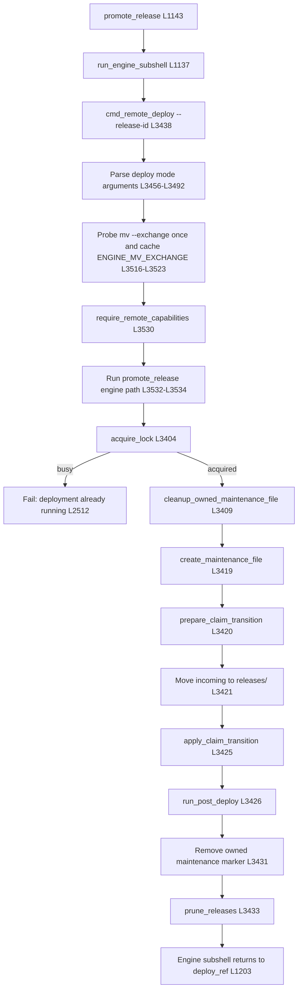

The deploy lock is non-blocking. If another deploy, update, or rollback is
already promoting the same deployment id, the later command fails with
`deployment already running` instead of waiting.

## Internal Engine: Claim Preparation

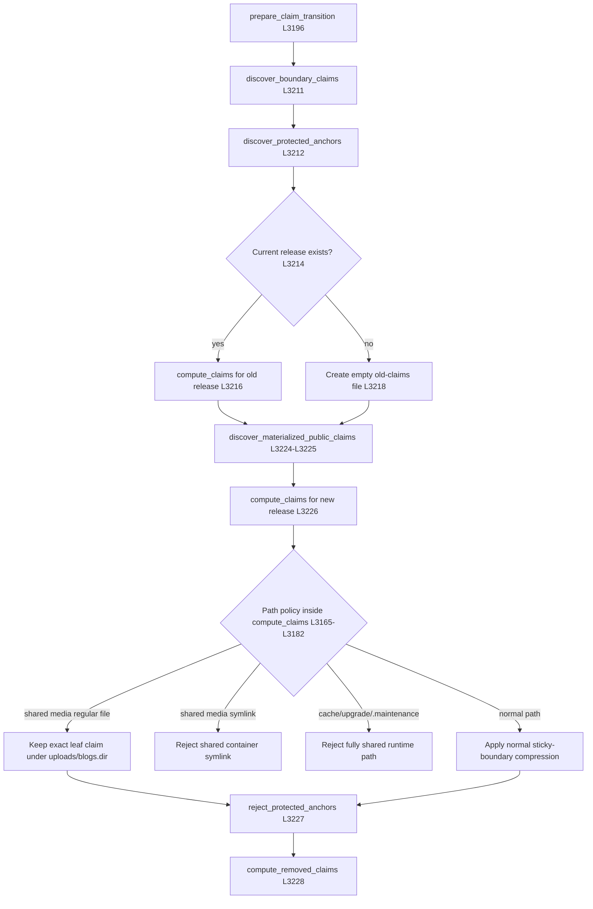

`wp-content/uploads` and `wp-content/blogs.dir` are WordPress-managed persistent
containers. The engine can claim regular files inside them as individual leaf
symlinks, but it never replaces those container directories and rejects repo
symlinks inside them.

## Internal Engine: Claim Application

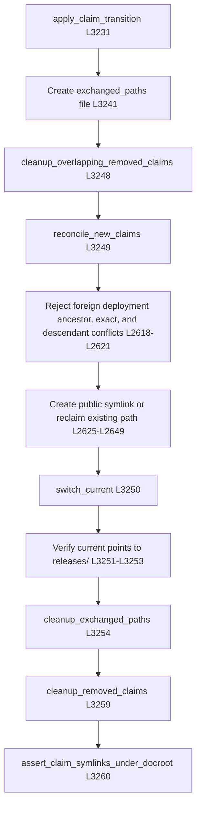

Promotion creates docroot-relative symlinks for owned claims and switches the
`current` symlink atomically. Existing public paths are reclaimed with
`mv --exchange` when available, otherwise with the `exchange-rename` helper.

## Rollback

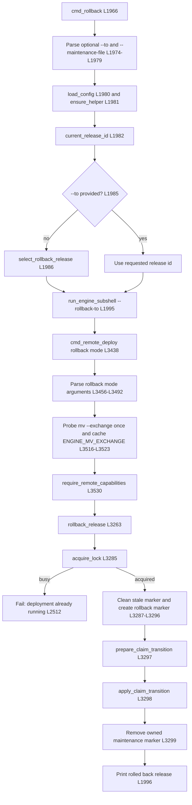

Rollback reuses the claim preparation and application engine path, but it does
not create a new incoming release, write release metadata, or prune releases.

## Inspection And Status Commands

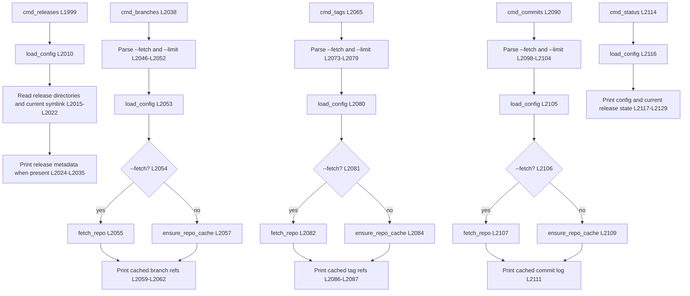

Inspection commands use cached repository data by default. `--fetch` refreshes
the cache before printing.

## Hidden Internal Command And Full Audit

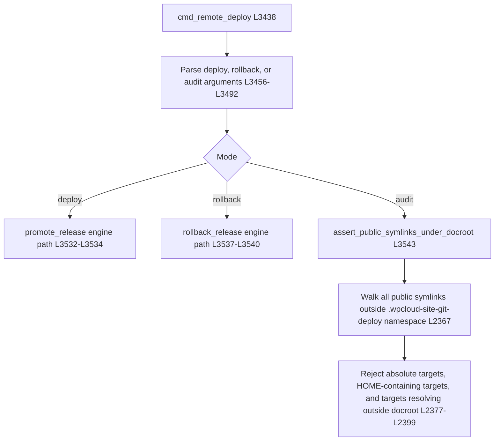

The hidden audit path intentionally performs a full-docroot scan. Deploy and
rollback use the scoped claim assertion in the engine hot path; the audit remains
available for diagnostics and tests.
