# Code Flow

This document maps each public verb to the Go code path that handles it. The
charts are intentionally split by verb so a maintainer can audit one command
without reading the whole CLI. Line links point to the current implementation and
should be refreshed when the relevant code moves.

All public commands enter through `main`, parse into a `cli.Command`, resolve the
tool state layout, and dispatch by verb.

## Verb Index

This table is the fastest way to understand command intent before dropping into
the flowcharts.

| Verb | Primary handler | Main package boundary | Mutates state? | Intent |
| --- | --- | --- | --- | --- |
| `help`, `--help`, `-h` | `runHelp` | `internal/cli` | No | Print command syntax. |
| `version`, `--version` | `runVersion` | `internal/cli` | No | Print build version. |
| `init` | `runInit` | `internal/config` | `$HOME` config | Create a deployment config. |
| `list` | `runList` | `internal/state` | No | List configured deployment names. |
| `status` | `runStatus` | `internal/config` | No | Print one deployment config. |
| `config` | `runConfig` | `internal/config` | `$HOME` config | Set or unset supported config keys. |
| `deploy` | `runDeploy` | `internal/engine` | `$HOME` cache/worktree and docroot release namespace | Fetch, stage, promote, and record a release. |
| `rollback` | `runRollback` | `internal/engine` | docroot public links and current pointer | Make an existing release current. |
| `releases` | `runReleases` | `internal/releases` | No | List release ids and mark current. |
| `branches` | `runInspection` | `internal/engine` | repo cache only when `--fetch` is set | Inspect cached or freshly fetched branch refs. |
| `tags` | `runInspection` | `internal/engine` | repo cache only when `--fetch` is set | Inspect cached or freshly fetched tags. |
| `commits` | `runInspection` | `internal/engine` | repo cache only when `--fetch` is set | Inspect cached or freshly fetched commits. |
| `auth` | `runAuth` | `internal/auth` | config and optional managed key files | Configure or remove the deploy key. |
| `doctor` | `runDoctor` | `internal/doctor` | No | Report environment, key, Git, claims, and symlink health. |
| `destroy` | `runDestroy` | `internal/state` | `$HOME` tool-managed state | Remove config/cache/tmp/managed keys, but not the served docroot release. |

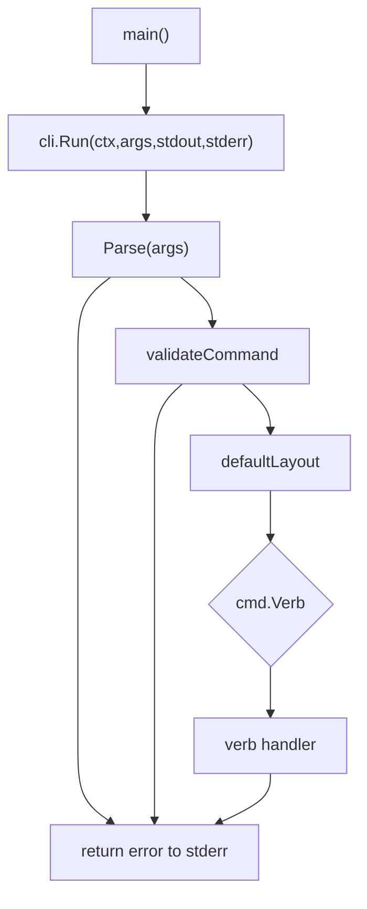

Source anchors:

- Entry point: [cmd/wpcloud-site-git-deploy/main.go](../cmd/wpcloud-site-git-deploy/main.go#L10)
- Parser: [internal/cli/parser.go](../internal/cli/parser.go#L75)
- Validation: [internal/cli/parser.go](../internal/cli/parser.go#L156)
- Dispatcher: [internal/cli/run.go](../internal/cli/run.go#L124)
- State layout root: [internal/cli/run.go](../internal/cli/run.go#L456)

## Help And Version

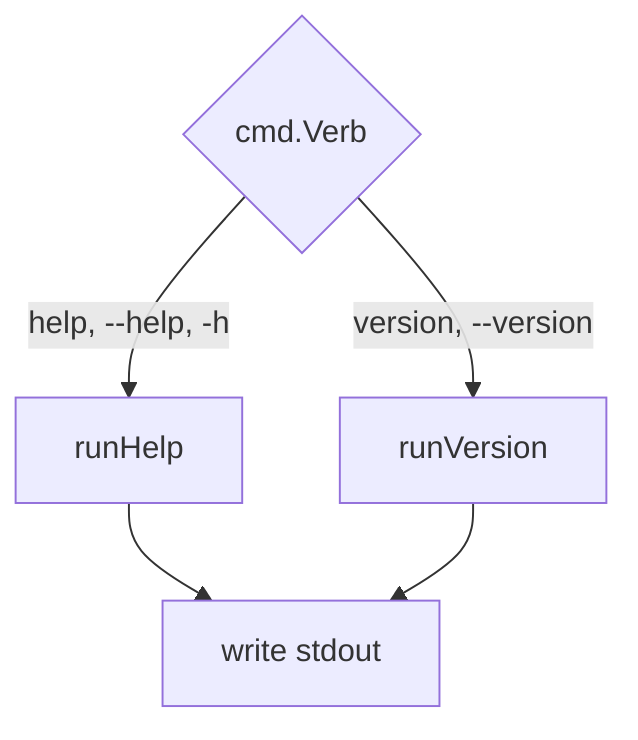

Source anchors:

- Dispatch cases: [internal/cli/run.go](../internal/cli/run.go#L133)
- Help output: [internal/cli/run.go](../internal/cli/run.go#L166)
- Version output: [internal/cli/run.go](../internal/cli/run.go#L195)

## `init`

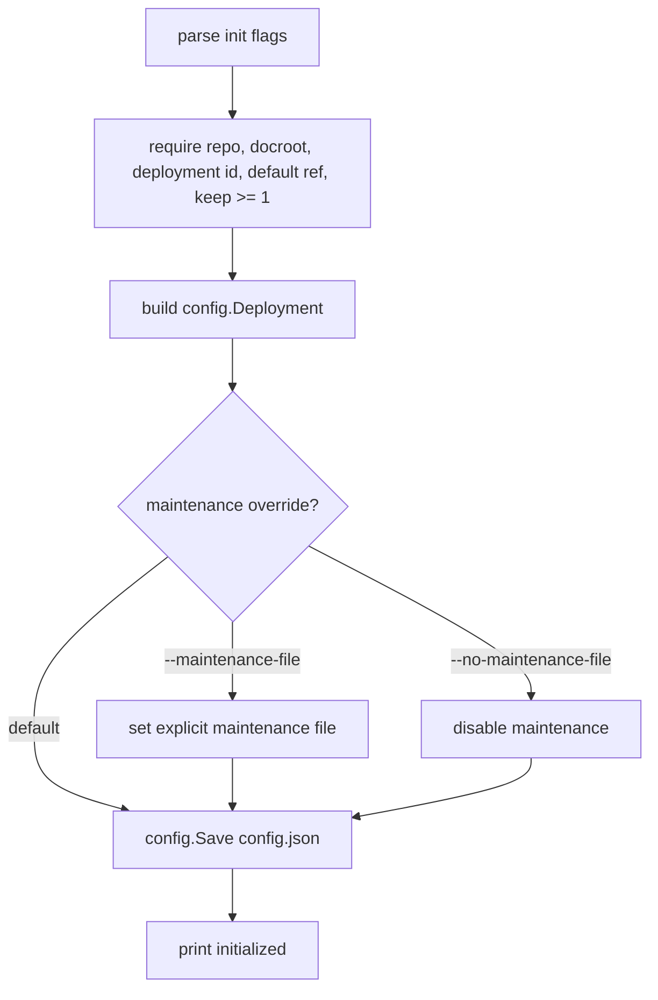

Source anchors:

- Init flags: [internal/cli/parser.go](../internal/cli/parser.go#L94)
- Init validation: [internal/cli/parser.go](../internal/cli/parser.go#L169)
- Handler: [internal/cli/run.go](../internal/cli/run.go#L200)
- Config save: [internal/config/config.go](../internal/config/config.go#L80)

## `list`

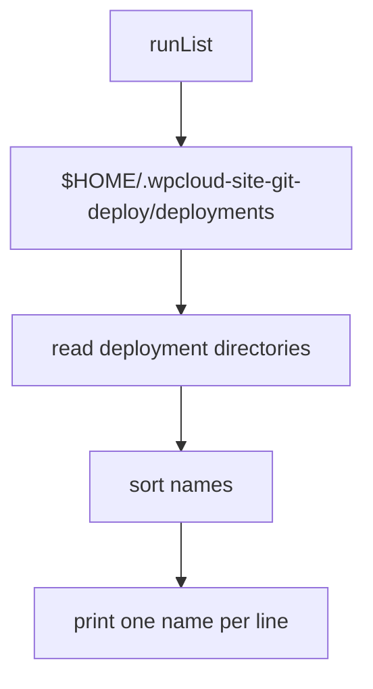

Source anchors:

- Handler: [internal/cli/run.go](../internal/cli/run.go#L226)
- Directory enumeration: [internal/cli/run.go](../internal/cli/run.go#L464)
- State deployment directory: [internal/state/state.go](../internal/state/state.go#L18)

## `status`

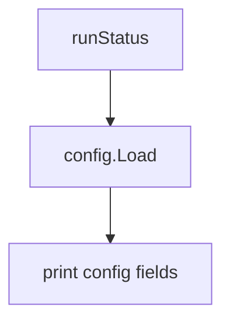

Source anchors:

- Handler: [internal/cli/run.go](../internal/cli/run.go#L237)
- Status output: [internal/cli/run.go](../internal/cli/run.go#L483)
- Config load: [internal/config/config.go](../internal/config/config.go#L113)

## `config`

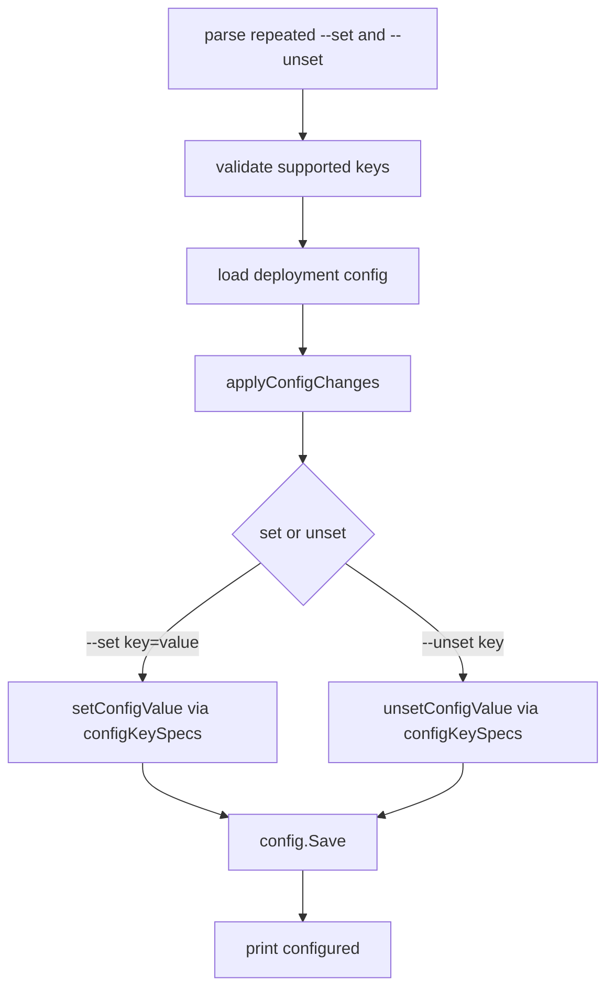

Source anchors:

- Config flags: [internal/cli/parser.go](../internal/cli/parser.go#L102)
- Config validation: [internal/cli/parser.go](../internal/cli/parser.go#L188)
- Key registry: [internal/cli/run.go](../internal/cli/run.go#L31)
- Handler: [internal/cli/run.go](../internal/cli/run.go#L246)
- Apply/set/unset: [internal/cli/run.go](../internal/cli/run.go#L500)

## `deploy`

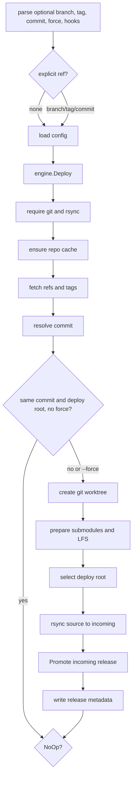

Source anchors:

- Deploy flags: [internal/cli/parser.go](../internal/cli/parser.go#L105)
- Ref validation: [internal/cli/parser.go](../internal/cli/parser.go#L206)
- CLI handler: [internal/cli/run.go](../internal/cli/run.go#L261)
- Engine entry: [internal/engine/deploy.go](../internal/engine/deploy.go#L34)
- Repo cache and fetch: [internal/engine/deploy.go](../internal/engine/deploy.go#L46)
- No-op check: [internal/engine/deploy.go](../internal/engine/deploy.go#L59)
- Worktree: [internal/engine/deploy.go](../internal/engine/deploy.go#L70)
- Git features: [internal/engine/deploy.go](../internal/engine/deploy.go#L234)
- Rsync incoming: [internal/engine/deploy.go](../internal/engine/deploy.go#L308)
- Promotion call: [internal/engine/deploy.go](../internal/engine/deploy.go#L113)
- Metadata write: [internal/engine/deploy.go](../internal/engine/deploy.go#L123)

### Deploy Decision Tree

The decision tree below shows why a deploy exits early, no-ops, or proceeds to
promotion. The table after it is usually better for auditing the safety intent of
each branch.

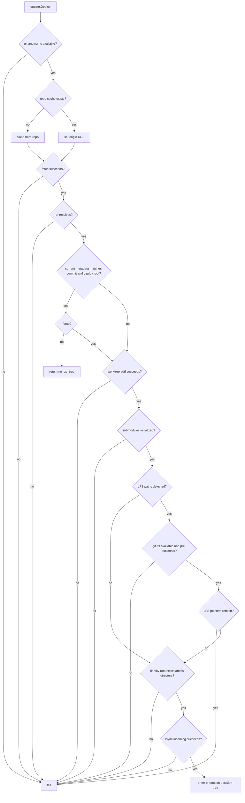

Source anchors:

- Command requirements: [internal/engine/deploy.go](../internal/engine/deploy.go#L35)
- Repo cache behavior: [internal/engine/deploy.go](../internal/engine/deploy.go#L137)
- Fetch and GC: [internal/engine/deploy.go](../internal/engine/deploy.go#L49)
- Ref resolution: [internal/engine/deploy.go](../internal/engine/deploy.go#L194)
- No-op decision: [internal/engine/deploy.go](../internal/engine/deploy.go#L59)
- Worktree cleanup: [internal/engine/deploy.go](../internal/engine/deploy.go#L70)
- Submodule decision: [internal/engine/deploy.go](../internal/engine/deploy.go#L235)
- LFS decision: [internal/engine/deploy.go](../internal/engine/deploy.go#L253)
- Deploy root decision: [internal/engine/deploy.go](../internal/engine/deploy.go#L85)
- Rsync/link-dest: [internal/engine/deploy.go](../internal/engine/deploy.go#L308)

Deploy decisions:

| Decision | Success path | Failure or alternate path | Why it exists |
| --- | --- | --- | --- |
| Required commands | Continue when `git` and `rsync` are present. | Fail before touching state. | Deploy depends on Git object access and rsync staging semantics. |
| Repo cache | Reuse existing bare cache or clone it. | Fail if clone/cache access fails. | Keeps repeated deploys fast while preserving a single source of refs. |
| Fetch | Fetch refs/tags and run best-effort GC. | Fail if fetch fails. | Deploy must compare against the latest remote state. |
| Ref resolution | Resolve branch, tag, or commit to a commit SHA. | Fail if the requested ref is invalid. | Release metadata records the exact commit that was promoted. |
| No-op check | Return `no_op=true` when commit and deploy root match current metadata. | Continue when `--force` is set or metadata differs. | Makes cron-safe deploys cheap while preserving intentional redeploys. |
| Worktree | Add a detached worktree for the target commit. | Fail and clean temp worktree. | Keeps the cache bare and stages from a real filesystem tree. |
| Submodules | Initialize recursively and verify none remain uninitialized. | Fail before rsync. | A served release should not contain unresolved submodule placeholders. |
| Git LFS | Hydrate LFS files and reject remaining pointer files. | Fail before rsync. | Prevents publishing pointer text where binary/site assets are expected. |
| Deploy root | Use configured subdirectory as effective repo root. | Fail if missing or not a directory. | Monorepo/build-output deploys should publish subfolder contents at docroot root. |
| Rsync staging | Copy source into incoming, hardlinking unchanged files where possible. | Fail before promotion. | Incoming must be complete before public claims are touched. |

### Promotion Decision Tree

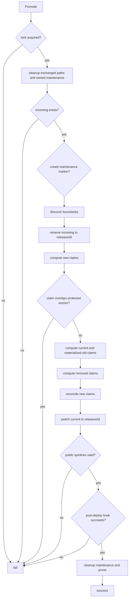

Source anchors:

- Promotion entry and lock: [internal/engine/promote.go](../internal/engine/promote.go#L45)
- Incoming/release move: [internal/engine/promote.go](../internal/engine/promote.go#L71)
- Maintenance creation: [internal/engine/promote.go](../internal/engine/promote.go#L80)
- Claim computation: [internal/engine/promote.go](../internal/engine/promote.go#L105)
- Protected anchors: [internal/engine/promote.go](../internal/engine/promote.go#L109)
- Materialized claims: [internal/engine/promote.go](../internal/engine/promote.go#L116)
- Reconciliation: [internal/engine/promote.go](../internal/engine/promote.go#L268)
- Current switch: [internal/engine/promote.go](../internal/engine/promote.go#L315)
- Symlink assertion: [internal/publicfs/publicfs.go](../internal/publicfs/publicfs.go#L28)
- Post-deploy hook: [internal/engine/promote.go](../internal/engine/promote.go#L608)
- Pruning: [internal/releases/releases.go](../internal/releases/releases.go#L109)

Promotion phases:

| Phase | Reads | Writes | Intent |
| --- | --- | --- | --- |
| Lock and retry cleanup | `deploy.lock`, `exchanged_paths` | lock file, removed stale exchange temp paths | Ensure only one deploy for a deployment id mutates the namespace and retry previous cleanup. |
| Maintenance marker | configured maintenance path | tool-owned PHP marker | Ask WordPress to serve maintenance mode during promotion and hooks. |
| Incoming to release | `incoming/<id>` | `releases/<id>` | Move complete staged content into the release namespace before public links point at it. |
| Claim computation | new release tree, current release tree, materialized public symlinks | in-memory claim sets | Determine which public paths must exist and which old owned paths can be removed. |
| Protected checks | docroot ownership/writability | none | Refuse to claim root/group-owned protected anchors. |
| Reconciliation | public docroot paths | public symlinks, exchanged path log | Create or atomically reclaim public paths. |
| Current switch | release namespace | `current` relative symlink | Flip active release with a single rename. |
| Assertion and hook | public symlinks, post-deploy script | hook-defined side effects | Validate symlink containment, then run operator hook. |
| Cleanup and prune | maintenance marker, releases dir | removed marker, pruned old releases | Leave the site out of maintenance and bound release retention. |

### Claim Reconciliation Decision Tree

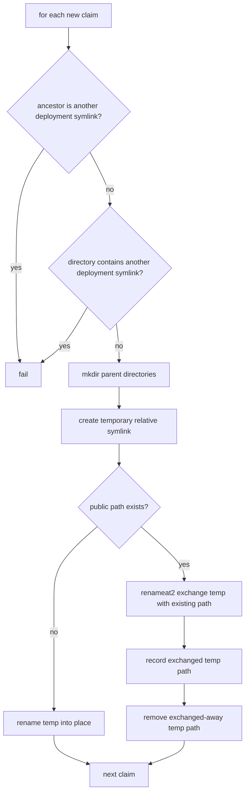

Source anchors:

- Reconcile loop: [internal/engine/promote.go](../internal/engine/promote.go#L268)
- Foreign ancestor rejection: [internal/engine/promote.go](../internal/engine/promote.go#L389)
- Foreign descendant rejection: [internal/engine/promote.go](../internal/engine/promote.go#L407)
- Relative public target: [internal/publicfs/publicfs.go](../internal/publicfs/publicfs.go#L12)
- Atomic exchange: [internal/publicfs/exchange_linux.go](../internal/publicfs/exchange_linux.go#L8)
- Exchanged path cleanup: [internal/engine/promote.go](../internal/engine/promote.go#L468)

Claim reconciliation outcomes:

| Existing public path | Result | Reason |
| --- | --- | --- |
| Missing | Rename new relative symlink into place. | No visible path needs reclaiming. |
| Normal file or directory | Exchange new symlink with existing path, then delete exchanged-away temp path. | Reclaim atomically without a missing-path window. |
| Exact foreign deployment symlink | Exchange and take over exact public path. | Same-path ownership is user intent; no extra policy is imposed. |
| Foreign deployment symlink in an ancestor | Fail. | The new claim would route through another deployment's `current`. |
| Foreign deployment symlink below a real directory being claimed | Fail. | Replacing the directory would engulf another deployment. |

### Claim Computation Decision Tree

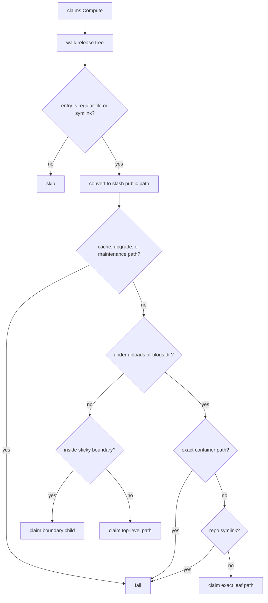

Source anchors:

- Shared path lists: [internal/claims/claims.go](../internal/claims/claims.go#L14)
- Claim walker: [internal/claims/claims.go](../internal/claims/claims.go#L28)
- Shared media rules: [internal/claims/claims.go](../internal/claims/claims.go#L76)
- Boundary compression: [internal/claims/claims.go](../internal/claims/claims.go#L116)

Claim policy table:

| Release-tree path | Claim behavior | Why |
| --- | --- | --- |
| `.git`, `.wpcloud-site-git-deploy` | Skip. | Internal VCS/tool state must never become public claims. |
| `wp-content/cache`, `wp-content/upgrade`, maintenance file | Reject. | Runtime/control paths are not deploy targets. |
| Regular file under `wp-content/uploads` or `wp-content/blogs.dir` | Claim exact leaf path. | WordPress owns the container directory; deploy owns only its leaf file symlink. |
| Symlink under `wp-content/uploads` or `wp-content/blogs.dir` | Reject. | A symlink can behave like a directory or point outside the regular-file safety model. |
| Path under sticky boundary | Claim the first child under the deepest boundary. | Avoid claiming an entire platform-managed boundary. |
| Other nested path | Claim top-level segment. | Normal deploys can publish a compact top-level tree symlink. |

## `rollback`

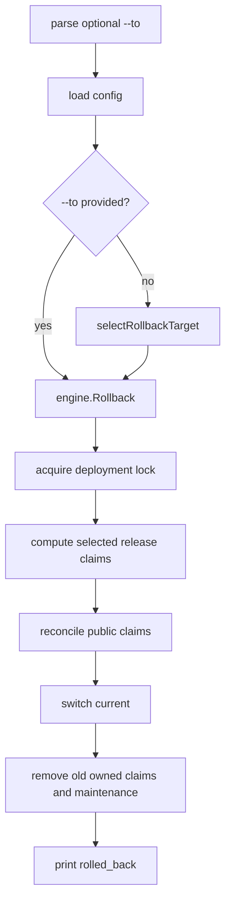

Source anchors:

- Rollback flag: [internal/cli/parser.go](../internal/cli/parser.go#L111)
- CLI handler: [internal/cli/run.go](../internal/cli/run.go#L286)
- Default target selection: [internal/cli/run.go](../internal/cli/run.go#L550)
- Engine rollback: [internal/engine/promote.go](../internal/engine/promote.go#L160)

## `releases`

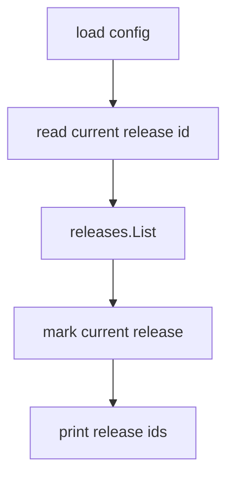

Source anchors:

- CLI handler: [internal/cli/run.go](../internal/cli/run.go#L306)
- Current release id: [internal/state/state.go](../internal/state/state.go#L55)
- Release listing: [internal/releases/releases.go](../internal/releases/releases.go#L81)

## `branches`, `tags`, And `commits`

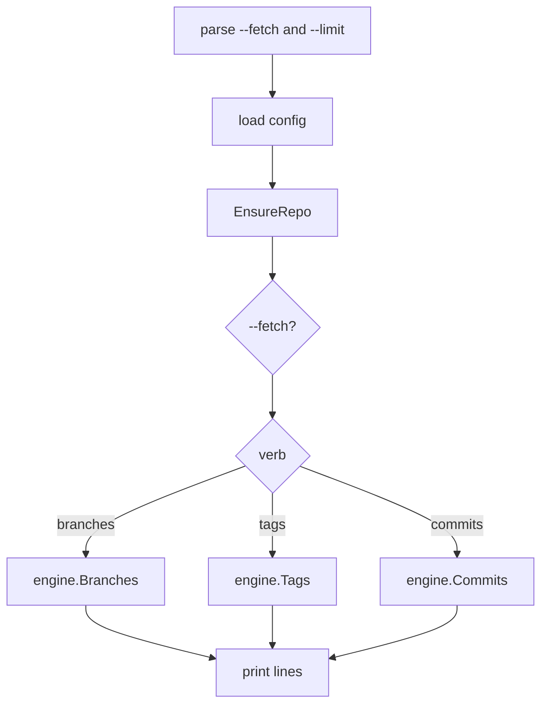

Source anchors:

- Shared flags: [internal/cli/parser.go](../internal/cli/parser.go#L113)
- CLI handler: [internal/cli/run.go](../internal/cli/run.go#L327)
- Repo cache/fetch: [internal/engine/deploy.go](../internal/engine/deploy.go#L151)
- Branches/tags/commits: [internal/engine/deploy.go](../internal/engine/deploy.go#L167)

## `auth`

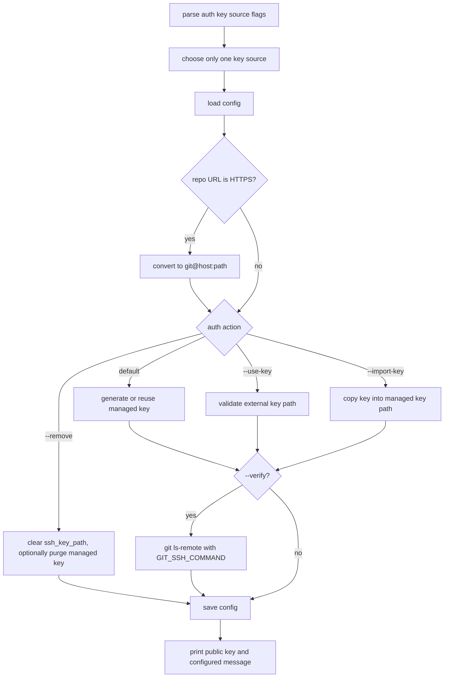

Source anchors:

- Auth flags: [internal/cli/parser.go](../internal/cli/parser.go#L116)
- Key-source validation: [internal/auth/auth.go](../internal/auth/auth.go#L32)
- CLI handler: [internal/cli/run.go](../internal/cli/run.go#L354)
- HTTPS conversion: [internal/auth/auth.go](../internal/auth/auth.go#L19)
- Key generation/import/use: [internal/auth/keys.go](../internal/auth/keys.go#L15)
- Remote verification: [internal/auth/keys.go](../internal/auth/keys.go#L141)

## `doctor`

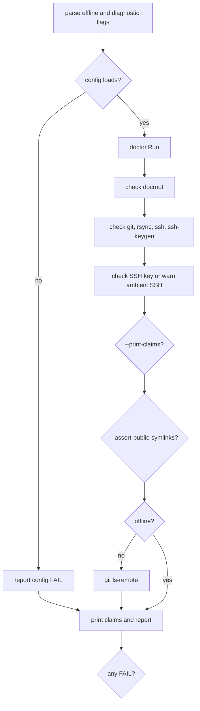

Source anchors:

- Doctor flags: [internal/cli/parser.go](../internal/cli/parser.go#L123)
- CLI handler: [internal/cli/run.go](../internal/cli/run.go#L412)
- Doctor checks: [internal/doctor/run.go](../internal/doctor/run.go#L26)
- Claims diagnostic: [internal/engine/promote.go](../internal/engine/promote.go#L237)
- Symlink diagnostic: [internal/engine/promote.go](../internal/engine/promote.go#L250)

## `destroy`

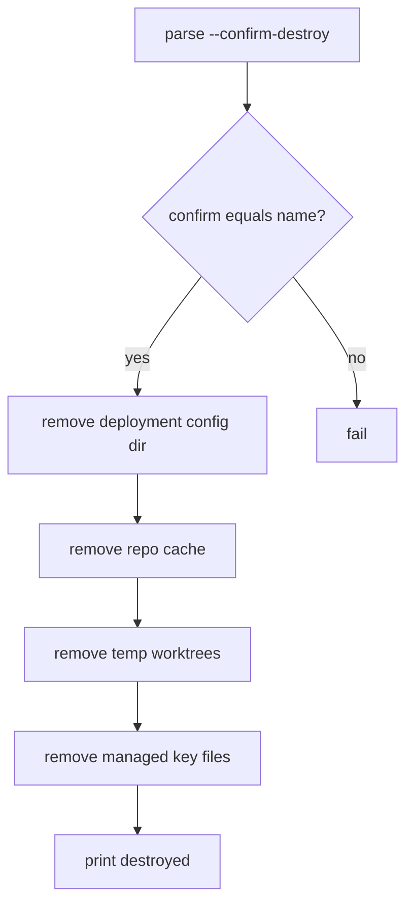

Source anchors:

- Destroy flag: [internal/cli/parser.go](../internal/cli/parser.go#L127)
- Destroy validation: [internal/cli/parser.go](../internal/cli/parser.go#L228)
- Handler: [internal/cli/run.go](../internal/cli/run.go#L436)
