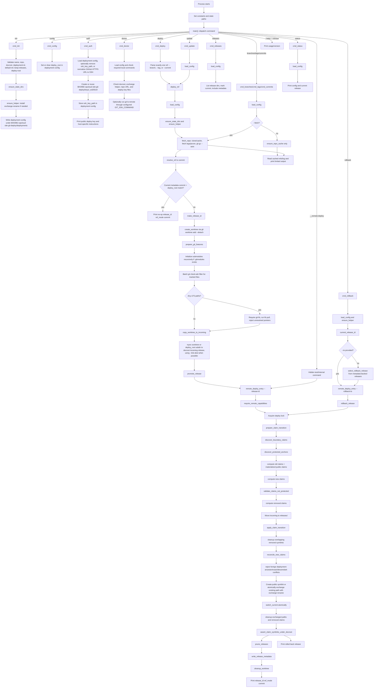

# `bin/wpcloud-site-git-deploy` Code Flow

This diagram covers the current `main` branch layout. The project is a Bash CLI
with an embedded remote deployment engine. `__remote-deploy` is hidden from the
public help output because it is for tests, promotion, rollback, and diagnostic
audits, not for day-to-day operator use.

The public commands stay in the top-level CLI. The former remote deployment
engine now lives inside `remote_deploy_entry()` and is reachable through the
hidden `__remote-deploy` command for tests and internal promotion/rollback use.

The production entry points are `init`, `config`, `deploy`, `update`,
`rollback`, `releases`, `branches`, `tags`, `commits`, `status`, `auth`, and
`doctor`. The hidden command is documented here only so maintainers can follow
the embedded code path.
