# `bin/wpcloud-site-git-deploy` Code Flow

This diagram covers the current `main` branch layout. The project is one Bash
CLI with an internal promotion engine. `__remote-deploy` is hidden from the
public help output because it is for tests, promotion, rollback, and diagnostic
audits, not for day-to-day operator use. Handler entry nodes use function start
lines; other line numbers point to where the diagrammed action is executed in
`bin/wpcloud-site-git-deploy`.

```mermaid
flowchart TD
  A["Process starts L1"] --> B["Set constants and state paths L4-L57"]
  B --> C["main() dispatch case L3551"]

  C -->|init| I["main calls cmd_init L3559"]
  I --> I1["cmd_init validates name, repo, docroot, deployment-id, default-ref, keep-releases, deploy-root, maintenance_file L1863-L1895"]
  I1 --> I2["ensure_state_dirs L1897"]
  I2 --> I3["ensure_helper L1898: use mv --exchange when available, otherwise use or install exchange-rename"]
  I3 --> I4["write_config L1907: deployments/<name>/cfg-* value files"]

  C -->|config| CFG["main calls cmd_config L3562"]
  CFG --> CFG1["cmd_config sets or clears cfg-deploy_root, cfg-post_deploy, or cfg-maintenance_file L1820-L1844"]

  C -->|auth| AU["main calls cmd_auth L3589"]
  AU --> AU1["load_config L1664, optionally remove ssh_key_path, or normalize HTTPS URL to SSH when applicable"]
  AU1 --> AU2["auth_resolve_key L1723: generate/reuse managed key, --use-key external key, or --import-key managed copy"]
  AU2 --> AU3["auth_resolve_key L1406/L1411/L1447 validates private keys and L1378/L1439 derives public keys"]
  AU3 --> AU4["write_config L1729: store cfg-ssh_key_path"]
  AU4 --> AU5["Print public deploy key and host-specific instructions L1738-L1743"]

  C -->|doctor| DOC["main calls cmd_doctor L3592"]
  DOC --> DOC1["load_config L1770 and doctor_check_commands L1777"]
  DOC1 --> DOC2["doctor_check_docroot L1780, repo URL L1783, exchange L1786, ssh key L1789, git-lfs L1792"]
  DOC2 --> DOC3["doctor_check_git_remote L1795: optionally run git ls-remote through configured GIT_SSH_COMMAND"]

  C -->|deploy| D["main calls cmd_deploy L3565"]
  D --> D1["cmd_deploy parses exactly one ref plus optional --force, --post-deploy, and --maintenance-file L1923-L1933"]
  D1 --> DR["deploy_ref L1167"]

  C -->|update| U["main calls cmd_update L3568"]
  U --> U1["cmd_update parses optional --force, --post-deploy, and --maintenance-file, then load_config L1954-L1962"]
  U1 --> DR

  DR --> DR1["load_config L1184"]
  DR1 --> DR2["ensure_state_dirs L1185 and ensure_helper L1186"]
  DR2 --> DR3["fetch_repo L1189: clone/cache, fetch tags/prune, git gc --auto"]
  DR3 --> DR4["resolve_ref L1190 to commit"]
  DR4 --> NR{"current_release_matches L1192 and no --force?"}
  NR -->|yes| NRO["Print no-op release_id ref_mode commit L1193"]
  NR -->|no| DR5["make_release_id L1197"]
  DR5 --> DR6["create_worktree L1198; git worktree add happens at L962"]
  DR6 --> PGF["prepare_git_features L964"]
  PGF --> PGF1["Initialize submodules recursively at L799 if .gitmodules exists"]
  PGF1 --> PGF2["Batch git check-attr filter for tracked files at L809"]
  PGF2 --> PGF3{"Any LFS paths? L831"}
  PGF3 -->|yes| PGF4["Require git-lfs L833, run lfs pull L841, reject unresolved pointers L850"]
  PGF3 -->|no| DR7["copy_worktree_to_incoming L1199"]
  PGF4 --> DR7
  DR7 --> DR8["rsync worktree or deploy_root subdir to docroot incoming release at L1044, using --link-dest when possible"]
  DR8 --> PR["promote_release L1203"]

  PR --> RDE["run_engine_subshell L1137 -> cmd_remote_deploy --release-id"]
  RDE --> EXC["cmd_remote_deploy L3516-L3523: probe mv --exchange once, cache ENGINE_MV_EXCHANGE, and set default exchange helper when needed"]
  EXC --> ERQ["require_remote_capabilities L3530"]
  ERQ --> ELOCK["acquire_lock L3404"]
  ELOCK -->|busy| EBUSY["Fail: deployment already running L2512"]
  ELOCK -->|acquired| EMNT["cleanup stale marker L3409 and create_maintenance_file L3419"]
  EMNT --> EPCT["prepare_claim_transition L3420"]
  EPCT --> EPCT1["discover_boundary_claims L3211"]
  EPCT1 --> EPCT2["discover_protected_anchors L3212"]
  EPCT2 --> EPCT3["compute old claims L3216 + materialized public claims L3224-L3225"]
  EPCT3 --> EPCT4["compute_claims L3226 for new release"]
  EPCT4 --> EPCT5["apply shared media container policy in compute_claims L3165-L3182 and reject protected anchors L3227"]
  EPCT5 --> EPCT6["compute_removed_claims L3228"]
  EPCT6 --> MOVE["Move incoming to releases/<release-id> at L3421"]
  MOVE --> EACT["apply_claim_transition L3425"]
  EACT --> EACT1["cleanup_overlapping_removed_claims L3248"]
  EACT1 --> EACT2["reconcile_new_claims L3249"]
  EACT2 --> EACT3["reject foreign deployment ancestor/exact/descendant conflicts L2618-L2621"]
  EACT3 --> EACT4["Create public symlink or atomically exchange existing path using cached mv --exchange decision or exchange-rename L2625-L2649"]
  EACT4 --> EACT5["switch_current L3250 atomically"]
  EACT5 --> EACT6["cleanup_exchanged_paths L3254 and cleanup_removed_claims L3259"]
  EACT6 --> EACT7["assert_claim_symlinks_under_docroot L3260"]
  EACT7 --> POST["run_post_deploy L3426 when --post-deploy-file was provided"]
  POST --> RMNT["Remove owned maintenance marker L3431"]
  RMNT --> PRUNE["prune_releases L3433"]
  PRUNE --> ENGRET["Engine subshell returns to deploy_ref L1203"]
  ENGRET --> META["write_release_metadata L1207 as metadata/<release-id>/cfg-* files"]
  META --> CLEAN["cleanup_worktree L1211"]
  CLEAN --> OUT["Print release_id ref_mode commit L1212"]

  C -->|rollback| RB["main calls cmd_rollback L3571"]
  RB --> RB1["load_config L1980 and ensure_helper L1981"]
  RB1 --> RB2["current_release_id L1982"]
  RB2 --> RB3{"--to provided? L1985"}
  RB3 -->|no| RB4["select_rollback_release L1986 from metadata-backed releases"]
  RB3 -->|yes| RBR["run_engine_subshell L1995 -> cmd_remote_deploy --rollback-to"]
  RB4 --> RBR
  RBR --> REXC["cmd_remote_deploy L3516-L3523: probe mv --exchange once, cache ENGINE_MV_EXCHANGE, and set default exchange helper when needed"]
  REXC --> RRC["require_remote_capabilities L3530"]
  RRC --> RLOCK["acquire_lock L3285"]
  RLOCK -->|busy| RBUSY["Fail: deployment already running L2512"]
  RLOCK -->|acquired| RMNT1["rollback_release L3287/L3296: clean stale marker and create rollback marker unless disabled"]
  RMNT1 --> RPCT["prepare_claim_transition L3297 for existing release"]
  RPCT --> RACT["apply_claim_transition L3298"]
  RACT --> RACT1["switch_current L3250 atomically and clean removed claims"]
  RACT1 --> RACT2["assert_claim_symlinks_under_docroot L3260"]
  RACT2 --> RMNT2["Remove owned maintenance marker L3299"]
  RMNT2 --> RRET["Engine subshell returns to cmd_rollback L1995"]
  RRET --> RBOUT["Print rolled back release L1996"]

  C -->|releases| REL["main calls cmd_releases L3574"]
  REL --> REL1["load_config L2010"]
  REL1 --> REL2["List release dirs, mark current, include metadata L2015-L2035"]

  C -->|branches/tags/commits| INS["main calls cmd_branches L3577 / cmd_tags L3580 / cmd_commits L3583"]
  INS --> INS1["load_config L2053/L2080/L2105"]
  INS1 --> INS2{"--fetch? L2054/L2081/L2106"}
  INS2 -->|yes| DR3
  INS2 -->|no| ERC["ensure_repo_cache L2057/L2084/L2109 only"]
  ERC --> INS3["Read cached refs/log and print limited output L2059-L2062/L2086-L2087/L2111"]
  DR3 --> INS3

  C -->|status| ST["main calls cmd_status L3586"]
  ST --> ST1["load_config L2116"]
  ST1 --> ST2["Print config and current release L2117-L2129"]

  C -->|__remote-deploy| H["Hidden test/internal command L3595"]
  H --> CRD["cmd_remote_deploy L3595"]
  CRD --> CRD1["Parse deploy, rollback, or audit mode L3456-L3492, cache exchange capability L3516-L3523, and run the matching path L3532-L3543"]

  C -->|--help / --version| HV["usage L3598 or VERSION output L3601"]
```

The public commands and hidden diagnostic/internal command share the same final
dispatcher. Promotion and rollback call the internal engine through
`run_engine_subshell` so engine exits remain contained and caller cleanup paths
stay live. The hidden `__remote-deploy` command calls `cmd_remote_deploy`
directly for tests and audits.

The deploy lock is non-blocking: if another deploy, update, or rollback is
already promoting the same deployment id, the later command fails with
`deployment already running` instead of waiting.

The production entry points are `init`, `config`, `deploy`, `update`,
`rollback`, `releases`, `branches`, `tags`, `commits`, `status`, `auth`, and
`doctor`. The hidden command is documented here only so maintainers can follow
the embedded code path.
