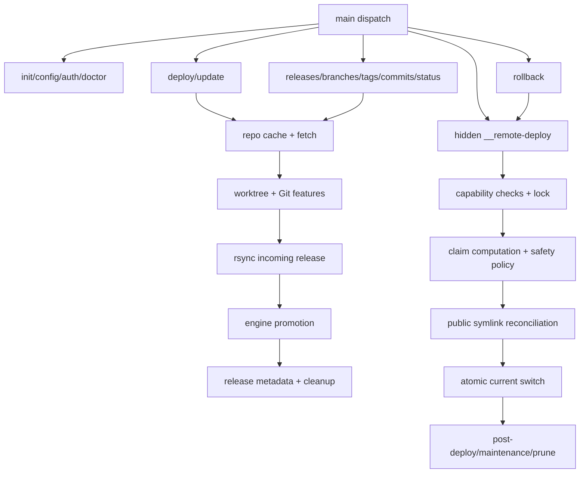

# `bin/wpcloud-site-git-deploy` Code Flow

This document covers the current `main` branch layout. The project is one Bash
CLI with an internal promotion engine. `__remote-deploy` is hidden from public
help because it is for tests, promotion, rollback, and diagnostic audits, not
day-to-day operator use.

The Mermaid diagram gives the shape of the system. The tables below it are the
auditable flow: each source link points to where that action happens in
`bin/wpcloud-site-git-deploy`.

## Command Dispatch

| Command | Source | What Happens |
|---|---:|---|
| Process entry | [L3016](../bin/wpcloud-site-git-deploy#L3016) | Calls `main "$@"`. |
| Dispatch command | [L2964-L3012](../bin/wpcloud-site-git-deploy#L2964-L3012) | Routes public commands and hidden `__remote-deploy`. |
| `--help` | [L3004-L3006](../bin/wpcloud-site-git-deploy#L3004-L3006) | Prints public usage. |
| `--version` | [L3007-L3009](../bin/wpcloud-site-git-deploy#L3007-L3009) | Prints the `VERSION` constant. |

## Setup And Diagnostics

| Step | Source | What Happens |
|---|---:|---|
| `init` dispatch | [L2965-L2967](../bin/wpcloud-site-git-deploy#L2965-L2967) | Calls `cmd_init`. |
| Parse and validate `init` | [L1557-L1577](../bin/wpcloud-site-git-deploy#L1557-L1577) | Validates name, repo, docroot, deployment id, default ref, retention, deploy root, and maintenance file. |
| Create state directories | [L1579](../bin/wpcloud-site-git-deploy#L1579) | Ensures state, repo cache, temp, bin, and key directories exist. |
| Check/install exchange helper | [L1580](../bin/wpcloud-site-git-deploy#L1580) | Uses native `mv --exchange` when available, otherwise uses or installs `exchange-rename`. |
| Write config | [L1581-L1589](../bin/wpcloud-site-git-deploy#L1581-L1589) | Stores deployment config as one `cfg-*` value file per option. |
| `config` dispatch | [L2968-L2970](../bin/wpcloud-site-git-deploy#L2968-L2970) | Calls `cmd_config`. |
| Apply config action | [L1516-L1541](../bin/wpcloud-site-git-deploy#L1516-L1541) | Sets or clears deploy root, post-deploy hook, or maintenance-file setting. |
| `auth` dispatch | [L2995-L2997](../bin/wpcloud-site-git-deploy#L2995-L2997) | Calls `cmd_auth`. |
| Load auth config | [L1407-L1408](../bin/wpcloud-site-git-deploy#L1407-L1408) | Loads deployment config and ensures state directories. |
| Remove auth | [L1410-L1428](../bin/wpcloud-site-git-deploy#L1410-L1428) | Clears configured key path and optionally purges managed key files. |
| Normalize HTTPS repo URL | [L1441-L1445](../bin/wpcloud-site-git-deploy#L1441-L1445) | Converts HTTPS URLs to SSH form before deploy-key setup. |
| Resolve key source | [L1447-L1449](../bin/wpcloud-site-git-deploy#L1447-L1449) | Generates, reuses, imports, or references a private key. |
| Use external key | [L1178-L1182](../bin/wpcloud-site-git-deploy#L1178-L1182) | Validates an existing external private key and derives its public key. |
| Import key | [L1183-L1205](../bin/wpcloud-site-git-deploy#L1183-L1205) | Copies an existing private key into the managed key directory and derives `.pub`. |
| Generate/reuse key | [L1206-L1227](../bin/wpcloud-site-git-deploy#L1206-L1227) | Reuses or creates the managed ed25519 key and validates it. |
| Store key config | [L1451-L1452](../bin/wpcloud-site-git-deploy#L1451-L1452) | Writes `cfg-ssh_key_path`. |
| Print deploy-key instructions | [L1453-L1461](../bin/wpcloud-site-git-deploy#L1453-L1461) | Prints provider-specific or generic deploy-key guidance. |
| Verify auth | [L1463-L1465](../bin/wpcloud-site-git-deploy#L1463-L1465) | Runs `git ls-remote` through configured `GIT_SSH_COMMAND`. |
| `doctor` dispatch | [L2998-L3000](../bin/wpcloud-site-git-deploy#L2998-L3000) | Calls `cmd_doctor`. |
| Load doctor config | [L1482-L1487](../bin/wpcloud-site-git-deploy#L1482-L1487) | Loads config or reports an uninitialized deployment. |
| Run doctor checks | [L1489-L1495](../bin/wpcloud-site-git-deploy#L1489-L1495) | Checks commands, docroot, repo URL, exchange support, SSH key, LFS, and remote access. |

## Deploy And Update

| Step | Source | What Happens |
|---|---:|---|
| `deploy` dispatch | [L2971-L2973](../bin/wpcloud-site-git-deploy#L2971-L2973) | Calls `cmd_deploy`. |
| Parse deploy args | [L1602-L1614](../bin/wpcloud-site-git-deploy#L1602-L1614) | Requires exactly one ref selector and passes optional overrides to `deploy_ref`. |
| `update` dispatch | [L2974-L2976](../bin/wpcloud-site-git-deploy#L2974-L2976) | Calls `cmd_update`. |
| Parse update args | [L1624-L1632](../bin/wpcloud-site-git-deploy#L1624-L1632) | Uses the configured default branch and optional overrides. |
| Load deploy config | [L1007](../bin/wpcloud-site-git-deploy#L1007) | Loads deployment config. |
| Ensure runtime state | [L1008-L1009](../bin/wpcloud-site-git-deploy#L1008-L1009) | Ensures state directories and exchange helper availability. |
| Fetch repo | [L1012](../bin/wpcloud-site-git-deploy#L1012) | Updates the repo cache. |
| Cache clone/fetch/gc | [L636-L638](../bin/wpcloud-site-git-deploy#L636-L638) | Ensures cache, fetches tags/prunes origin, then runs `git gc --auto`. |
| Resolve ref | [L1013](../bin/wpcloud-site-git-deploy#L1013) | Resolves branch, tag, or commit to a commit SHA. |
| No-op check | [L1014-L1017](../bin/wpcloud-site-git-deploy#L1014-L1017) | Skips deploy when commit and deploy root match the active metadata unless `--force` is set. |
| Make release id | [L1018](../bin/wpcloud-site-git-deploy#L1018) | Creates a unique release id for this deployment instance. |
| Create worktree | [L1019](../bin/wpcloud-site-git-deploy#L1019) | Creates a temp worktree for the resolved commit. |
| Git worktree add | [L816-L818](../bin/wpcloud-site-git-deploy#L816-L818) | Prunes old worktrees, adds a detached worktree, then hydrates Git features. |
| Submodules | [L676-L680](../bin/wpcloud-site-git-deploy#L676-L680) | Initializes recursive submodules when `.gitmodules` exists. |
| LFS detection | [L686-L697](../bin/wpcloud-site-git-deploy#L686-L697) | Batches `git check-attr` and detects LFS-tracked paths. |
| LFS hydration | [L698-L710](../bin/wpcloud-site-git-deploy#L698-L710) | Requires `git-lfs`, pulls objects, and rejects unresolved pointer files. |
| Copy to incoming | [L1020-L1023](../bin/wpcloud-site-git-deploy#L1020-L1023) | RSyncs deploy source into the docroot incoming release, then cleans up on failure. |
| Select deploy root | [L864-L870](../bin/wpcloud-site-git-deploy#L864-L870) | Treats configured repo subdirectory as the deploy root and rejects missing roots. |
| Hardlink basis | [L876-L884](../bin/wpcloud-site-git-deploy#L876-L884) | Adds `--link-dest` against current release when available. |
| RSync incoming | [L885](../bin/wpcloud-site-git-deploy#L885) | Copies the deploy source into `incoming/<release-id>`. |
| Promote release | [L1024-L1027](../bin/wpcloud-site-git-deploy#L1024-L1027) | Runs the internal engine in a subshell and cleans up worktree on failure. |
| Write metadata | [L1028-L1030](../bin/wpcloud-site-git-deploy#L1028-L1030) | Writes metadata only after promotion succeeds. |
| Clean worktree | [L1032](../bin/wpcloud-site-git-deploy#L1032) | Removes temp worktree and prunes Git worktree state. |
| Print deploy result | [L1033](../bin/wpcloud-site-git-deploy#L1033) | Prints `release_id ref_mode commit`. |

## Internal Promotion Engine

| Step | Source | What Happens |
|---|---:|---|
| Build engine argv | [L973-L985](../bin/wpcloud-site-git-deploy#L973-L985) | Builds `__remote-deploy` arguments for release promotion. |
| Enter engine subshell | [L987](../bin/wpcloud-site-git-deploy#L987) | Runs `cmd_remote_deploy` in a contained subshell. |
| Parse engine args | [L2881-L2903](../bin/wpcloud-site-git-deploy#L2881-L2903) | Parses hidden command mode and options. |
| Handle audit mode | [L2917-L2921](../bin/wpcloud-site-git-deploy#L2917-L2921) | Runs full-docroot symlink audit and returns. |
| Cache exchange capability | [L2925-L2931](../bin/wpcloud-site-git-deploy#L2925-L2931) | Probes `mv --exchange` once and records whether native exchange is available for this engine run. |
| Set cleanup trap | [L2934-L2938](../bin/wpcloud-site-git-deploy#L2934-L2938) | Configures maintenance cleanup state and engine exit trap. |
| Require remote capabilities | [L2939](../bin/wpcloud-site-git-deploy#L2939) | Checks required GNU/Linux tools before changing state. |
| Validate engine mode | [L2941](../bin/wpcloud-site-git-deploy#L2941) | Rejects incompatible hidden engine arguments. |
| Dispatch promotion | [L2947-L2952](../bin/wpcloud-site-git-deploy#L2947-L2952) | Runs claim printing or incoming-release promotion. |
| Prepare promotion paths | [L2824-L2830](../bin/wpcloud-site-git-deploy#L2824-L2830) | Resolves deployment namespace paths for incoming, releases, lock, and exchange cleanup. |
| Acquire deploy lock | [L2832-L2833](../bin/wpcloud-site-git-deploy#L2832-L2833) | Creates namespace dirs and takes the non-blocking deployment lock. |
| Reject missing incoming | [L2835](../bin/wpcloud-site-git-deploy#L2835) | Fails if incoming release does not exist. |
| Clean stale exchange state | [L2836-L2838](../bin/wpcloud-site-git-deploy#L2836-L2838) | Retries prior exchange cleanup and removes stale scratch dirs. |
| Clean stale maintenance marker | [L2839](../bin/wpcloud-site-git-deploy#L2839) | Removes a tool-owned maintenance marker for this deployment if present. |
| Create scratch | [L2841](../bin/wpcloud-site-git-deploy#L2841) | Creates the per-run scratch directory. |
| Reject duplicate release | [L2842](../bin/wpcloud-site-git-deploy#L2842) | Fails if the target release directory already exists. |
| Create maintenance marker | [L2844](../bin/wpcloud-site-git-deploy#L2844) | Creates the optional WordPress maintenance marker before claim transition. |
| Prepare claims | [L2845](../bin/wpcloud-site-git-deploy#L2845) | Computes old, materialized, new, and removed claims. |
| Discover boundaries | [L2656](../bin/wpcloud-site-git-deploy#L2656) | Finds sticky boundary claims. |
| Discover protected anchors | [L2657](../bin/wpcloud-site-git-deploy#L2657) | Finds protected docroot anchors. |
| Compute old claims | [L2659-L2670](../bin/wpcloud-site-git-deploy#L2659-L2670) | Combines prior-release claims with materialized public symlinks. |
| Compute new claims | [L2671](../bin/wpcloud-site-git-deploy#L2671) | Computes claims for the incoming release and applies shared path policy. |
| Validate protected anchors | [L2672](../bin/wpcloud-site-git-deploy#L2672) | Rejects claims that collide with protected paths. |
| Compute removed claims | [L2673](../bin/wpcloud-site-git-deploy#L2673) | Computes claims removed by the new release. |
| Move incoming to release | [L2846](../bin/wpcloud-site-git-deploy#L2846) | Moves incoming release into `releases/<release-id>`. |
| Refresh release mtime | [L2849](../bin/wpcloud-site-git-deploy#L2849) | Touches promoted release so pruning keeps recent promotions. |
| Apply claim transition | [L2850](../bin/wpcloud-site-git-deploy#L2850) | Reconciles public symlinks and switches `current`. |
| Remove overlapping old symlinks | [L2693](../bin/wpcloud-site-git-deploy#L2693) | Removes exact old symlinks that would block parent/child claim changes. |
| Reconcile new claims | [L2694](../bin/wpcloud-site-git-deploy#L2694) | Creates or atomically exchanges public symlinks for new claims. |
| Reject foreign claims | [L2155-L2158](../bin/wpcloud-site-git-deploy#L2155-L2158) | Rejects ancestor, exact, or descendant claims owned by another deployment. |
| Create new symlink | [L2160-L2163](../bin/wpcloud-site-git-deploy#L2160-L2163) | Creates a temporary public symlink and moves it into place when the path is empty. |
| Exchange existing public path | [L2169-L2179](../bin/wpcloud-site-git-deploy#L2169-L2179) | Uses cached native exchange decision, falling back to `exchange-rename` helper when needed. |
| Switch current | [L2695](../bin/wpcloud-site-git-deploy#L2695) | Atomically repoints `current` at the promoted release. |
| Assert current target | [L2696](../bin/wpcloud-site-git-deploy#L2696) | Verifies `current` points to the expected release target. |
| Clean exchanged paths | [L2697-L2698](../bin/wpcloud-site-git-deploy#L2697-L2698) | Removes paths exchanged away during reclaim. |
| Clean removed claims | [L2702](../bin/wpcloud-site-git-deploy#L2702) | Removes exact owned symlinks no longer claimed by the release. |
| Assert scoped symlinks | [L2703](../bin/wpcloud-site-git-deploy#L2703) | Validates final owned public symlinks resolve under docroot. |
| Run post-deploy hook | [L2851-L2855](../bin/wpcloud-site-git-deploy#L2851-L2855) | Runs configured hook after current flips; failure leaves new release active and exits nonzero. |
| Remove maintenance marker | [L2856-L2857](../bin/wpcloud-site-git-deploy#L2856-L2857) | Removes the tool-owned maintenance marker after successful hook completion. |
| Prune releases | [L2858](../bin/wpcloud-site-git-deploy#L2858) | Prunes old non-active release directories. |

## Rollback

| Step | Source | What Happens |
|---|---:|---|
| `rollback` dispatch | [L2977-L2979](../bin/wpcloud-site-git-deploy#L2977-L2979) | Calls `cmd_rollback`. |
| Load rollback config | [L1647-L1649](../bin/wpcloud-site-git-deploy#L1647-L1649) | Loads config, checks helper, and reads current release. |
| Select default rollback target | [L1650-L1652](../bin/wpcloud-site-git-deploy#L1650-L1652) | Uses explicit `--to` or picks a metadata-backed release. |
| Build rollback engine argv | [L1653-L1657](../bin/wpcloud-site-git-deploy#L1653-L1657) | Builds hidden engine rollback arguments. |
| Run rollback engine | [L1658](../bin/wpcloud-site-git-deploy#L1658) | Runs rollback through the contained engine subshell. |
| Dispatch rollback in engine | [L2942-L2944](../bin/wpcloud-site-git-deploy#L2942-L2944) | Routes hidden command to `rollback_release`. |
| Prepare rollback paths | [L2720-L2724](../bin/wpcloud-site-git-deploy#L2720-L2724) | Resolves release, lock, and exchange cleanup paths. |
| Acquire rollback lock | [L2726-L2728](../bin/wpcloud-site-git-deploy#L2726-L2728) | Creates releases dir and takes deployment lock. |
| Validate rollback release | [L2730-L2734](../bin/wpcloud-site-git-deploy#L2730-L2734) | Cleans stale state and verifies rollback target exists. |
| Prepare rollback transition | [L2736-L2738](../bin/wpcloud-site-git-deploy#L2736-L2738) | Creates scratch/maintenance marker and computes claims for existing release. |
| Apply rollback transition | [L2739](../bin/wpcloud-site-git-deploy#L2739) | Reuses claim transition logic to repoint public symlinks and `current`. |
| Clean rollback maintenance marker | [L2740-L2741](../bin/wpcloud-site-git-deploy#L2740-L2741) | Removes owned maintenance marker and clears trap ownership state. |
| Print rollback result | [L1659](../bin/wpcloud-site-git-deploy#L1659) | Prints rolled-back release id after engine returns. |

## Inspection Commands

| Command | Source | What Happens |
|---|---:|---|
| `releases` dispatch | [L2980-L2982](../bin/wpcloud-site-git-deploy#L2980-L2982) | Calls `cmd_releases`. |
| List releases | [L1673-L1691](../bin/wpcloud-site-git-deploy#L1673-L1691) | Loads config, lists release dirs, marks current, and includes metadata. |
| `branches` dispatch | [L2983-L2985](../bin/wpcloud-site-git-deploy#L2983-L2985) | Calls `cmd_branches`. |
| `tags` dispatch | [L2986-L2988](../bin/wpcloud-site-git-deploy#L2986-L2988) | Calls `cmd_tags`. |
| `commits` dispatch | [L2989-L2991](../bin/wpcloud-site-git-deploy#L2989-L2991) | Calls `cmd_commits`. |
| Inspection fetch choice | [L1706-L1710](../bin/wpcloud-site-git-deploy#L1706-L1710), [L1729-L1733](../bin/wpcloud-site-git-deploy#L1729-L1733), [L1750-L1754](../bin/wpcloud-site-git-deploy#L1750-L1754) | Uses cached refs by default or fetches when `--fetch` is provided. |
| Print branches | [L1712-L1715](../bin/wpcloud-site-git-deploy#L1712-L1715) | Prints remote branches from cached refs. |
| Print tags | [L1735-L1736](../bin/wpcloud-site-git-deploy#L1735-L1736) | Prints tags from cached refs. |
| Print commits | [L1756](../bin/wpcloud-site-git-deploy#L1756) | Prints commits from cached default-ref history. |
| `status` dispatch | [L2992-L2994](../bin/wpcloud-site-git-deploy#L2992-L2994) | Calls `cmd_status`. |
| Print status | [L1761-L1772](../bin/wpcloud-site-git-deploy#L1761-L1772) | Prints config values and active release id. |

## Safety Invariants

| Invariant | Source | Why It Matters |
|---|---:|---|
| Public targets must stay under docroot | [L1994-L2026](../bin/wpcloud-site-git-deploy#L1994-L2026) | HTTP requests cannot follow symlinks into `$HOME`; scoped assertion validates final owned claims. |
| Full-docroot audit remains available | [L2917-L2921](../bin/wpcloud-site-git-deploy#L2917-L2921) | Hidden diagnostic mode scans all public symlinks for drift or foreign unsafe links. |
| Deploy lock is non-blocking | [L2067-L2073](../bin/wpcloud-site-git-deploy#L2067-L2073) | A second deploy/update/rollback fails instead of waiting and risking overlap. |
| Maintenance marker is trap-cleaned | [L1905-L1913](../bin/wpcloud-site-git-deploy#L1905-L1913) | Engine exit cleanup removes a tool-owned marker when the engine owns it. |
| Exchange decision is stable per engine run | [L2925-L2931](../bin/wpcloud-site-git-deploy#L2925-L2931), [L2169-L2179](../bin/wpcloud-site-git-deploy#L2169-L2179) | Avoids re-probing `mv --exchange` per reclaimed path and keeps helper choice consistent. |
| Shared runtime paths are rejected or constrained | [L2603-L2616](../bin/wpcloud-site-git-deploy#L2603-L2616) | Runtime paths such as cache/upgrade/maintenance are rejected; uploads/blogs.dir allow only regular-file leaf claims. |
| Protected anchors block claims | [L2672](../bin/wpcloud-site-git-deploy#L2672) | Prevents deploys from reclaiming non-writable/protected docroot anchors. |
| Cross-deployment claims are rejected | [L2155-L2158](../bin/wpcloud-site-git-deploy#L2155-L2158) | Prevents one deployment from claiming or engulfing another deployment's public paths. |
| Post-deploy failure does not roll back | [L2851-L2855](../bin/wpcloud-site-git-deploy#L2851-L2855) | New release remains active; command exits nonzero so operators can repair or roll back intentionally. |

The hidden `__remote-deploy` command is documented here only so maintainers can
follow the embedded code path. It is intentionally absent from public help.
